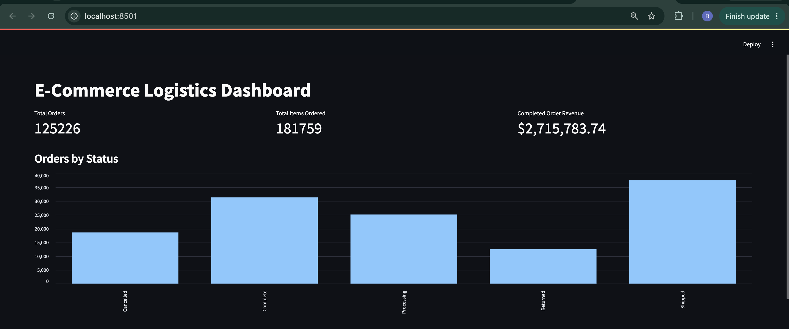
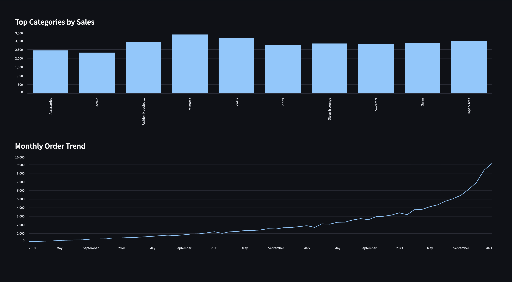
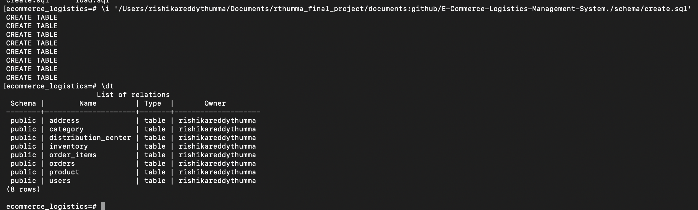
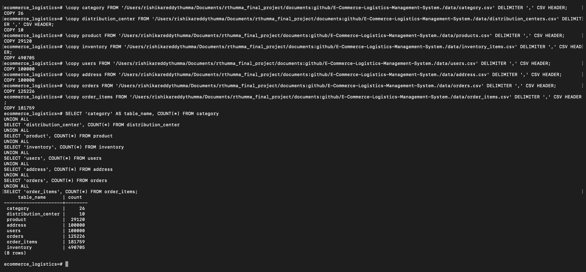
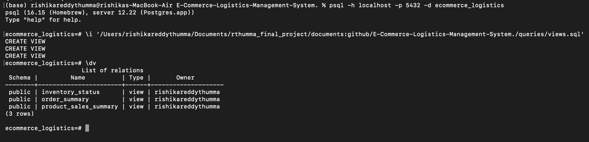
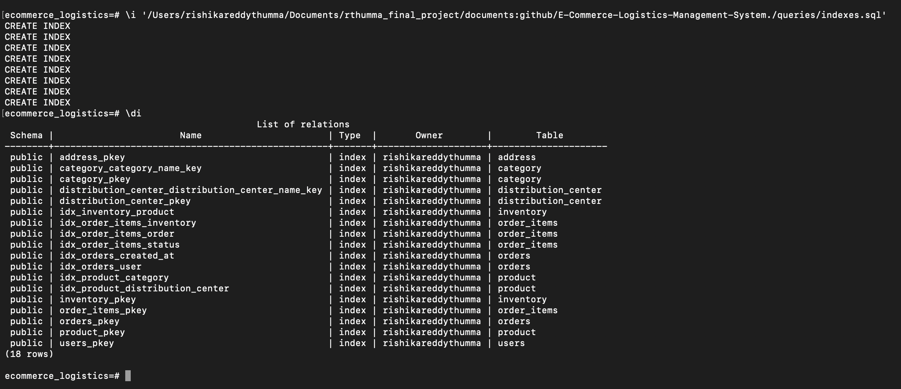
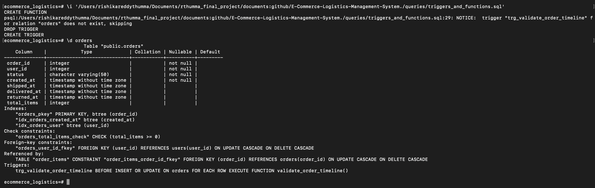
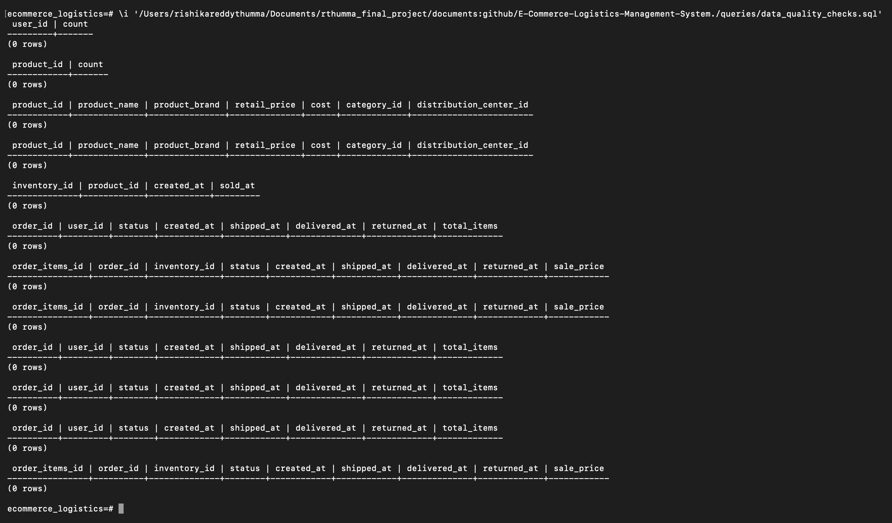

# E-Commerce Logistics Management System

## Overview

This project is a relational database system designed to manage core e-commerce logistics data, including products, inventory, customers, orders, and distribution centers.

The system uses PostgreSQL relationships, constraints, reusable views, analytics queries, indexes, data-quality checks, and database automation to organize and manage different parts of an e-commerce workflow.

A Streamlit dashboard is also included to provide an analytics layer on top of the PostgreSQL database.

## Features

- Product and category management
- Distribution center management
- Inventory tracking
- Customer and address management
- Order and order-item tracking
- Primary and foreign key relationships
- Data integrity constraints
- CSV-based data loading
- Business-focused SQL analytics
- Reusable database views
- Query performance optimization with indexes
- Data-quality validation queries
- PostgreSQL trigger-based order timeline validation
- Streamlit analytics dashboard
- Entity Relationship Diagram

## Database Tables

The database contains the following tables:

- `category`
- `distribution_center`
- `product`
- `inventory`
- `users`
- `address`
- `orders`
- `order_items`

## ER Diagram


## Dataset Load Results

The PostgreSQL database was successfully populated with:

- 26 categories
- 10 distribution centers
- 29,120 products
- 490,705 inventory records
- 100,000 users
- 100,000 addresses
- 125,226 orders
- 181,759 order items

## SQL Analytics

The project includes business-focused SQL queries for analyzing:

- Top-selling products
- Revenue by product
- Order status distribution
- Monthly order trends
- Return rates
- Inventory availability
- Top-performing categories
- Average order size

The queries are available in:

`queries/business_queries.sql`

### Sample Analytics Results

Some results from the dataset include:

- Return rate: `10.03%`
- Sold inventory: `181,759`
- Available inventory: `308,946`
- Average items per order: `1.45`

Top-performing categories included:

- Intimates
- Jeans
- Tops & Tees
- Fashion Hoodies & Sweatshirts
- Swim

## Database Views

Reusable PostgreSQL views were created for:

- Order summaries
- Product sales performance
- Inventory status

See:

`queries/views.sql`

The following views are created:

- `order_summary`
- `product_sales_summary`
- `inventory_status`

## Performance Optimization

Indexes were added to frequently joined and filtered columns, including:

- Product category
- Distribution center
- Inventory product
- Order user
- Order creation date
- Order references
- Inventory references
- Order-item status

See:

`queries/indexes.sql`

## Data Quality Checks

SQL validation queries are included to identify:

- Duplicate users
- Duplicate products
- Invalid product prices
- Missing category references
- Inventory records without valid products
- Orders without valid users
- Order items without valid orders
- Order items without valid inventory records
- Invalid shipping timelines
- Invalid delivery timelines
- Invalid return timelines
- Invalid sale prices

See:

`queries/data_quality_checks.sql`

The executed validation checks returned no invalid records for the tested conditions.

## Database Automation

A PostgreSQL trigger and PL/pgSQL function are included to validate order timelines.

The trigger prevents invalid records such as:

- Shipment dates earlier than order creation dates
- Delivery dates earlier than shipment dates
- Return dates earlier than delivery dates

See:

`queries/triggers_and_functions.sql`

The trigger is attached to the `orders` table and runs before inserts and updates.

## Analytics Dashboard

A Streamlit dashboard provides an analytics layer on top of the PostgreSQL database.

The dashboard displays:

- Total orders
- Total items ordered
- Completed-order revenue
- Orders by status
- Top categories by sales
- Monthly order trends

The dashboard connects directly to PostgreSQL using SQLAlchemy.

Dashboard files are available in:

`dashboard/`

## Dashboard Preview

### Overview



### Analytics



## Database Validation Screenshots

### Database Tables



### Loaded Row Counts



### Database Views



### Database Indexes



### Order Validation Trigger



### Data Quality Checks



## Repository Structure

```text
.
├── dashboard/
│   ├── app.py
│   └── requirements.txt
│
├── data/
│   ├── address.csv
│   ├── category.csv
│   ├── distribution_centers.csv
│   ├── inventory_items.csv
│   ├── order_items.csv
│   ├── orders.csv
│   ├── products.csv
│   └── users.csv
│
├── diagrams/
│   └── ER diagram.png
│
├── docs/
│   └── screenshots/
│       ├── business_queries_overview.png
│       ├── category_and_inventory_metrics.png
│       ├── dashboard_analytics.png
│       ├── dashboard_overview.png
│       ├── database_indexes.png
│       ├── database_tables.png
│       ├── database_views.png
│       ├── data_quality_checks.png
│       ├── monthly_order_trend.png
│       ├── order_trigger.png
│       └── row_counts.png
│
├── queries/
│   ├── business_queries.sql
│   ├── data_quality_checks.sql
│   ├── indexes.sql
│   ├── triggers_and_functions.sql
│   └── views.sql
│
├── schema/
│   ├── create_tables.sql
│   └── load_data.sql
│
├── .gitattributes
└── README.md
